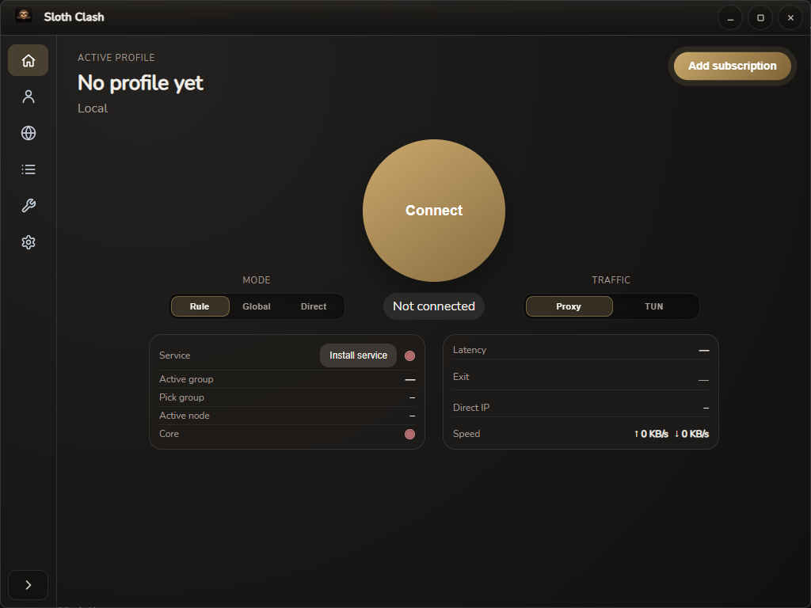

<h1 align="center">
  
  <br />
  Sloth Clash
  <br />
</h1>

<p align="center">
  <b>Clash Meta (Mihomo)</b> desktop client — <b>Wails · Go · React</b><br />
  Windows · macOS · Linux
</p>

<p align="center">
  <a href="./docs/README_ru.md">Русский</a> ·
  <a href="./docs/README_zh.md">简体中文</a>
  ·
  <a href="./Changelog.md">Changelog</a>
</p>

<p align="center">
  
</p>

---

## Overview

Sloth Clash is a **GPL-3.0** GUI around **Mihomo** (Clash Meta). This repository ships the **Wails** desktop shell (`apps/sloth-clash-desktop`). The Windows **system service / IPC** layer lives in a separate project: [sloth-clash-service-ipc](https://github.com/Nemu-x/sloth-clash-service-ipc) (release artifacts are consumed by `pnpm run prebuild`).

## Features (high level)

- Profiles, proxies, rules, and merge / script-style config workflows in the UI  
- Mihomo core integration (stable + optional alpha channel via prebuild)  
- Windows service installer bundle + sidecar layout compatible with Wails packaging  
- Deep link scheme `slothclash://` (see `wails.json`)

## Downloads

Releases for **this app**: [SlothClash releases](https://github.com/Nemu-x/SlothClash/releases) (when published).  
Service binaries used at build time: [sloth-clash-service-ipc releases](https://github.com/Nemu-x/sloth-clash-service-ipc/releases).

## Build (local)

Prerequisites: **Go 1.23+**, **Node 20+**, **pnpm**, Wails v2 (`go run github.com/wailsapp/wails/v2/cmd/wails@latest` works without a global install).

```bash
pnpm install
pnpm run desktop:resources   # mihomo sidecar, geo DBs, Sloth service exes, Windows icon → build/
pnpm run wails:dev           # or: pnpm run wails:build
```

`desktop:resources` writes under `apps/sloth-clash-desktop/build/` (ignored by git). On Windows, **`pnpm run icons:windows`** is included there and refreshes **`build/windows/icon.ico`** from `build/appicon.png` so installers / shortcuts pick up the right icon.

## CI

GitHub Actions: `.github/workflows/desktop-artifacts.yml` (Windows, Linux, macOS arm64 + Release) and `.github/workflows/desktop-artifacts-darwin-amd64.yml` (macOS Intel — same tag, adds zip to the same Release).

## Contributing

See [CONTRIBUTING.md](./CONTRIBUTING.md).

## Acknowledgements

- **Basis (upstream GUI this work descends from):** [clash-verge-rev](https://github.com/clash-verge-rev/clash-verge-rev) — Clash Verge Rev (Tauri); Sloth Clash reimplements the product direction with **Wails + Go** in this repo.
- **Proxy core (Clash Meta):** [MetaCubeX/mihomo](https://github.com/MetaCubeX/mihomo).
- **Desktop shell:** [Wails](https://github.com/wailsapp/wails) — Go backend + web frontend in one binary.

Also: [zzzgydi/clash-verge](https://github.com/zzzgydi/clash-verge) (original Clash Verge), and the wider Clash ecosystem.

## License

[GPL-3.0](./LICENSE)
